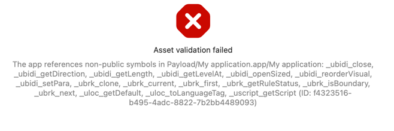

Reproduce bug https://github.com/JetBrains/compose-multiplatform/issues/3840

 - Set your TEAM_ID in file [Config.xcconfig](iosApp%2FConfiguration%2FConfig.xcconfig)
 - Run project in AndroidStudio and run iOS App once
 - Run script:
    ```bash
    cd iosApp
    pod install
    open iosApp.xcworkspace
    ```
 - Product -> Archive
 - (Not use Xcode Cloud)
 - Product -> Archive (again)
 - Validate App 
 - Use default settings for validation



Possible solution is to use `isStatic = false` in [build.gradle.kts](shared%2Fbuild.gradle.kts), or remove `pod 'FirebaseDatabase'` in [Podfile](iosApp%2FPodfile) 
